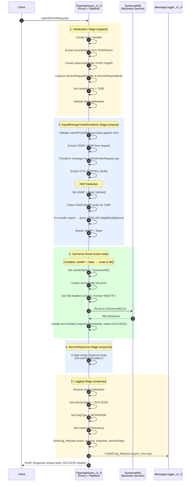
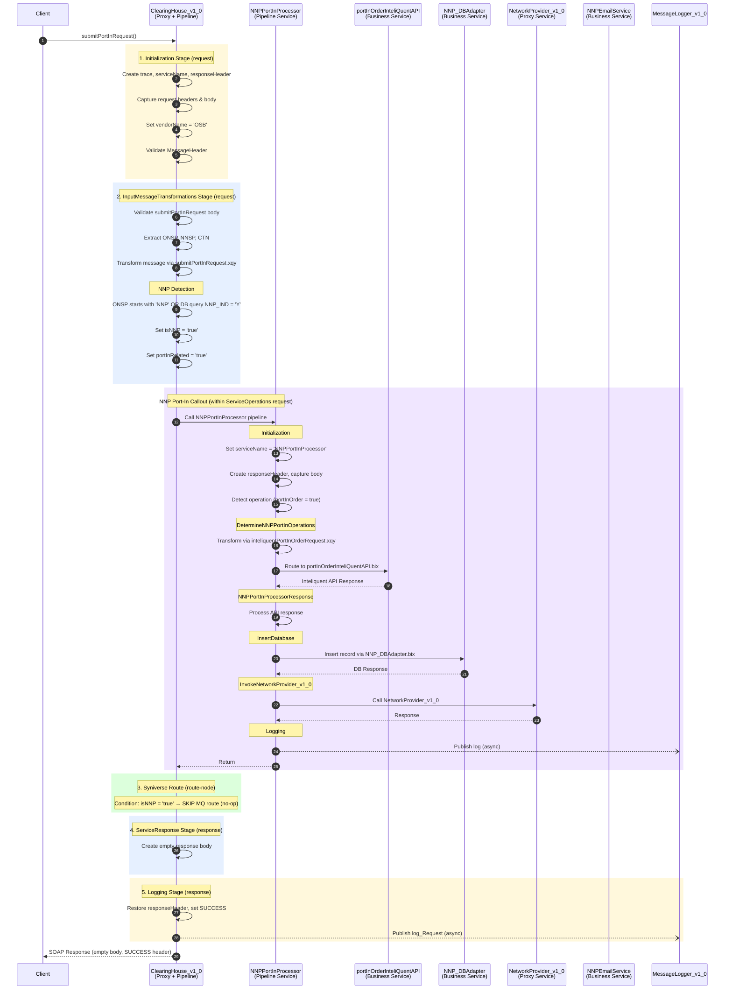
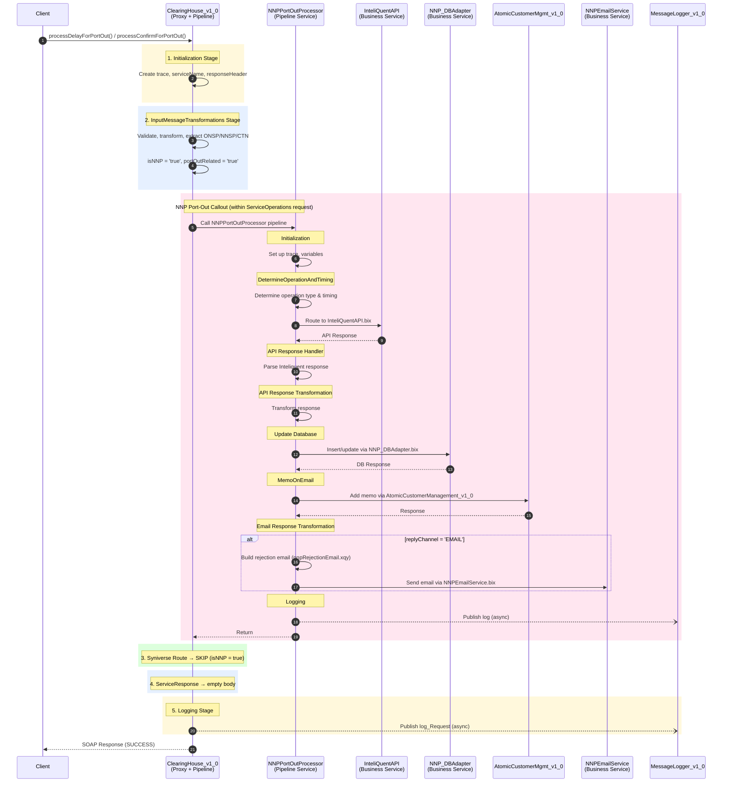
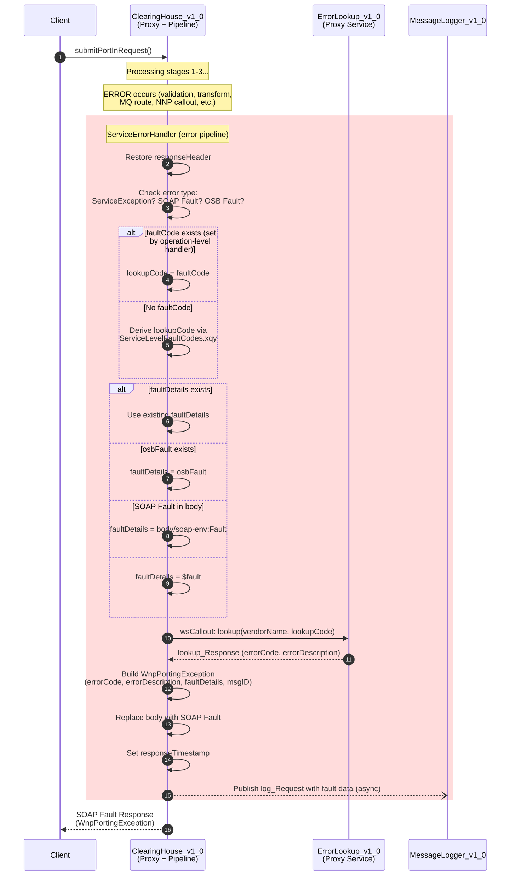
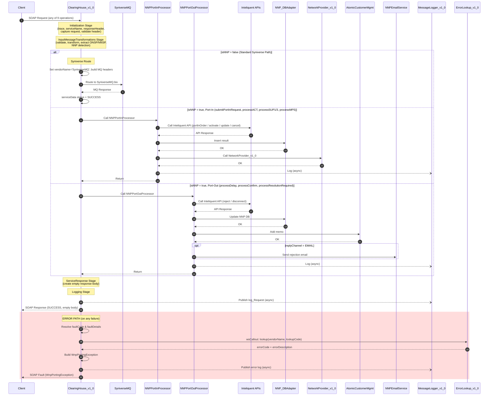

# ClearingHouse_v1_0 - Corrected Sequence Diagrams

## Pipeline Execution Order (for reference)

The main pipeline has this flow structure:

```
Request path (top-down):
  1. InitializationAndLogging_request  →  Initialization Stage
  2. ServiceOperations_request         →  InputMessageTransformations Stage
  3. Syniverse Route (route-node)      →  Only routes to MQ if isNNP='false'

Response path (bottom-up):
  3. Syniverse Route response transform
  2. ServiceOperations_response        →  ServiceResponse Stage (empty body)
  1. InitializationAndLogging_response →  Logging Stage (publish to MessageLogger)

Error path (on any fault):
  → ServiceErrorHandler               →  ErrorLookup + log + reply fault
```

---

## 1. Happy Path: submitPortInRequest (isNNP = false → Syniverse MQ)



---

## 2. Happy Path: submitPortInRequest (isNNP = true → NNP Port-In)



---

## 3. Happy Path: Port-Out Operations (isNNP = true → NNP Port-Out)

Applies to: `processDelayForPortOut`, `processConfirmForPortOut`, `processResolutionRequiredForPortOut`



---

## 4. Error Path (any stage failure)



---

## 5. Combined Overview (all paths in one diagram)



---

## Key Differences from Original Diagram

| # | Issue in Original | Correction |
|---|---|---|
| 1 | Initialization stage missing | Added as first stage before any routing |
| 2 | InputMessageTransformations stage missing | Added - validates, transforms, detects NNP |
| 3 | ServiceErrorHandler shown in happy path | Moved to error-only branch |
| 4 | ErrorLookup called in happy path | Only called during error handling |
| 5 | Syniverse MQ + NNP shown sequentially | They are mutually exclusive (isNNP flag) |
| 6 | NNP_DBAdapter calling NNP_DBAdapter-concrete | DBAdapter is a single JDBC business service |
| 7 | Missing Inteliquent API calls | Added for both port-in and port-out |
| 8 | Missing NetworkProvider_v1_0 | Added in NNPPortInProcessor flow |
| 9 | Missing AtomicCustomerManagement | Added in NNPPortOutProcessor flow |
| 10 | Logging shown as synchronous | Corrected to async publish (one-way) |
